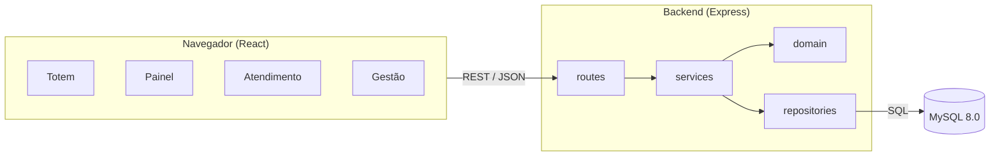

# nassauTickets

Sistema de **controle de atendimento por senhas** para um Laboratório de Análises Clínicas: emissão de senhas no totem, fila com regras de prioridade, chamada no painel com áudio, atendimento no guichê, relatórios gerenciais e auditoria.


## Sumário

- [Descrição](#descrição)
- [Objetivo](#objetivo)
- [Funcionalidades](#funcionalidades)
- [Tecnologias](#tecnologias)
- [Arquitetura](#arquitetura)
- [Estrutura do repositório](#estrutura-do-repositório)
- [Instalação](#instalação)
- [Configuração](#configuração)
- [Execução](#execução)
- [Como usar](#como-usar)
- [API REST](#api-rest)
- [Testes](#testes)
- [Branches](#branches)
- [Documentação](#documentação)
- [Membros](#membros)
- [Licença](#licença)

## Descrição

O sistema trabalha com três agentes:

| Agente | Papel |
|--------|-------|
| **AS** — Agente Sistema | Emite senhas, aplica as regras de prioridade, atualiza o painel, grava os dados e a auditoria. |
| **AA** — Agente Atendente | Faz login, chama a próxima senha, chama novamente, inicia e finaliza o atendimento no guichê. |
| **AC** — Agente Cliente | Retira a senha no totem (anonimamente) e acompanha a chamada no painel. |

Tipos de senha: **SP** (Prioritária), **SE** (Retirada de Exames) e **SG** (Geral).

## Objetivo

Organizar a fila do laboratório de forma justa e rastreável, respeitando as prioridades legais. Ao mesmo tempo, dar ao gestor indicadores (tempo médio de atendimento e de espera, taxa de não comparecimento, produtividade por guichê) para melhorar o serviço.

## Funcionalidades

- **Totem:** emissão de senha com um toque, número no padrão `YYMMDD-PPSQ` (ex.: `260923-SP001`), sequência por tipo com reinício diário.
- **Regra de prioridade:** `[SP] → [SE|SG] → [SP] → [SE|SG]`. Após uma SP vem uma SE (se houver) e depois uma SG. Se uma fila estiver vazia, o sistema usa a próxima pela mesma regra.
- **Painel:** as 5 últimas senhas chamadas, sem nunca mostrar a próxima da fila; anúncio por voz com tipo, senha e guichê; na rechamada, "**Última chamada**".
- **Atendimento:** chamar próxima, chamar novamente (uma vez), iniciar, finalizar e registrar não comparecimento. Após duas chamadas sem comparecimento, a senha é considerada abandonada.
- **Máquina de estados:** `EMITIDA → AGUARDANDO → CHAMADA → CHAMADA_NOVAMENTE → EM_ATENDIMENTO → ATENDIDA`, além de `NAO_COMPARECEU` e `DESCARTADA`.
- **Expediente das 7h às 17h:** fora dele não há emissão nem chamada. Às 17h, as senhas que ficaram na fila são descartadas automaticamente. Atendimentos em andamento continuam até serem finalizados.
- **Concorrência:** dois ou mais atendentes chamando ao mesmo tempo nunca recebem a mesma senha (trava pessimista no MySQL, coberta por testes automatizados).
- **Relatórios diário e mensal:** emitidas e atendidas (geral e por prioridade), tempo médio de atendimento e de espera, desempenho por guichê, emissões por hora, relatório detalhado e auditoria, com exportação para CSV e impressão.
- **Login e perfis:** atendente e gestor (gestor também atende). Cadastro de atendentes e guichês.
- **Recuperação de falhas:** se o backend ou o banco caírem, o painel mantém os últimos dados com o aviso "Sem conexão" e se reconecta sozinho, e o totem orienta o cliente a procurar a recepção.
- **Simulação:** gera dias completos de atendimento (TM de cada tipo e ~5% de não comparecimento) para demonstrar os relatórios.
- **LGPD e acessibilidade:** cliente anônimo, áudio, `aria-live`, alto contraste, navegação por teclado e layout responsivo.

## Tecnologias

| Camada | Tecnologia |
|--------|------------|
| Frontend | **React 19**, React Router 7, Vite, CSS puro |
| Backend | **Node.js 22 LTS** + **Express 5** |
| Banco de dados | **MySQL 8.0** (driver `mysql2`) |
| Segurança | JWT (`jsonwebtoken`), bcrypt (`bcryptjs`), Helmet, CORS |
| Testes | `node:test` (nativo do Node), Playwright (testes de interface) |
| Áudio | Web Speech API (voz pt-BR do navegador) |

### Por que Node.js + Express no backend?

- **Uma única linguagem (JavaScript)** no frontend e no backend: menos troca de contexto, mesmas ferramentas (npm) e mesmo formato de dados (JSON) de ponta a ponta.
- **Modelo assíncrono e não bloqueante:** adequado a uma API com muitas requisições curtas e simultâneas (painel consultando a cada 2 s, vários guichês e totens).
- **Express é simples e maduro:** rotas e middlewares explícitos, fáceis de entender e testar. O Express 5 trata erros de funções `async` nativamente.
- **Suporte da infraestrutura do laboratório:** Node.js LTS 22 com Express é uma das opções já homologadas na especificação.
- A concorrência crítica (duas chamadas simultâneas) é garantida no **banco** (transações InnoDB com `SELECT ... FOR UPDATE`), então o modelo de thread única do Node não é um limitador.

## Arquitetura



O backend é organizado em camadas:

| Camada | Pasta | Responsabilidade |
|--------|-------|------------------|
| Rotas | `backend/src/routes` | Recebem a requisição HTTP, validam parâmetros e devolvem JSON. |
| Middlewares | `backend/src/middlewares` | Autenticação (JWT), permissão de gestor e tratamento centralizado de erros. |
| Serviços | `backend/src/services` | Regras de negócio e transações (emissão, chamada, relatórios, simulação). |
| Domínio | `backend/src/domain` | Regras puras e testáveis: prioridade, numeração, máquina de estados e expediente. |
| Repositórios | `backend/src/repositories` | Todo o SQL (parametrizado) em um só lugar. |

O frontend separa `pages/` (telas), `components/` (peças reutilizáveis), `hooks/` (`usePolling`, `useSpeech`), `services/` (cliente HTTP), `context/` (autenticação) e `utils/` (formatação).

Mais detalhes em [docs/models/uml/diagramas.md](docs/models/uml/diagramas.md).

## Estrutura do repositório

```
nassauTickets/
├── backend/               API REST (Node.js + Express)
│   ├── database/          schema.sql (MySQL 8.0)
│   ├── scripts/           initDb.js (cria o banco) e simulate.js (simula dias)
│   ├── src/
│   │   ├── config/        variáveis de ambiente
│   │   ├── db/            pool de conexões e transações
│   │   ├── domain/        regras de negócio puras
│   │   ├── middlewares/   autenticação e erros
│   │   ├── repositories/  acesso a dados (SQL)
│   │   ├── routes/        endpoints REST
│   │   ├── services/      casos de uso
│   │   └── utils/
│   ├── tests/             testes automatizados
│   └── docker-compose.yml MySQL opcional via Docker
├── docs/
│   ├── branding/          logotipo, paleta e tipografia
│   ├── mer/               modelo entidade-relacionamento
│   ├── mockups/           telas do sistema
│   ├── models/uml/        casos de uso e diagramas UML
│   └── requirements/      requisitos, regras de negócio, disponibilidade
├── frontend/              aplicação React (Vite)
│   └── src/
│       ├── components/
│       ├── context/
│       ├── hooks/
│       ├── pages/
│       ├── services/
│       ├── styles/
│       └── utils/
├── .gitignore
├── LICENSE
└── README.md
```

## Instalação

### Pré-requisitos

- [Node.js 22 LTS](https://nodejs.org/) (inclui o npm)
- [MySQL 8.0](https://dev.mysql.com/downloads/mysql/), **ou** [Docker](https://www.docker.com/) para subir o MySQL com um comando, **ou** o MySQL/MariaDB do XAMPP/WAMP
- Git

### 1. Clonar o repositório

```bash
git clone https://github.com/renatopedrosa-ops/nassauTickets.git
cd nassauTickets
```

### 2. Banco de dados

**Opção A — Docker (mais simples):**

```bash
cd backend
docker compose up -d
```

**Opção B — MySQL instalado na máquina:** crie o usuário do sistema (ou use um usuário existente, ajustando o `.env`):

```sql
CREATE USER 'nassau'@'localhost' IDENTIFIED BY 'nassau123';
GRANT ALL ON nassau_tickets.* TO 'nassau'@'localhost';
GRANT ALL ON nassau_tickets_test.* TO 'nassau'@'localhost';
```

**Opção C — XAMPP ou WAMP (se você já usa):** basta iniciar o **MySQL** no painel do XAMPP/WAMP (o Apache e o PHP não são usados). O projeto é compatível com o MariaDB que vem no XAMPP. No `backend/.env`, use:

```
DB_USER=root
DB_PASSWORD=
```

(no XAMPP, o usuário `root` vem sem senha por padrão).

### 3. Backend

```bash
cd backend
npm install
cp .env.example .env        # no Windows: copy .env.example .env
npm run db:init             # cria as tabelas, 3 guichês e os usuários padrão
npm run simulate -- --days 10   # opcional: gera 10 dias de dados para os relatórios
```

### 4. Frontend

```bash
cd frontend
npm install
```

> **Atenção:** não abra o `frontend/index.html` direto no navegador nem pelo Live Server. A página fica em branco, porque o React (JSX) precisa ser processado pelo Vite. Use sempre `npm run dev` e acesse `http://localhost:5173`.
>
> **Dica (Windows):** evite pastas dentro do OneDrive ou com apóstrofo/espaços no caminho. Prefira algo como `C:\projetos\nassauTickets`.

## Configuração

Variáveis do backend (`backend/.env`, veja `backend/.env.example`):

| Variável | Padrão | Descrição |
|----------|--------|-----------|
| `PORT` | `3001` | Porta da API. |
| `APP_TIMEZONE` | `America/Recife` | Fuso usado no número da senha, no expediente e nos relatórios. |
| `CORS_ORIGIN` | `http://localhost:5173` | Origens permitidas (separadas por vírgula). |
| `DB_HOST` / `DB_PORT` | `localhost` / `3306` | Endereço do MySQL. |
| `DB_USER` / `DB_PASSWORD` | `nassau` / `nassau123` | Credenciais do MySQL. |
| `DB_NAME` | `nassau_tickets` | Nome do banco. |
| `JWT_SECRET` | — | Segredo de assinatura dos tokens. **Troque em produção.** |
| `JWT_EXPIRES_IN` | `10h` | Validade do login (um expediente). |
| `OPEN_HOUR` / `CLOSE_HOUR` | `7` / `17` | Horário do expediente. |
| `ENFORCE_BUSINESS_HOURS` | `true` | Use `false` para testar o sistema fora do horário comercial. |

Frontend (`frontend/.env`, opcional): `VITE_API_URL` (padrão `/api`, atendido pelo proxy do Vite, que encaminha para `http://localhost:3001`).

## Execução

Em dois terminais:

```bash
# Terminal 1 — API
cd backend
npm run dev          # http://localhost:3001/api

# Terminal 2 — Interface
cd frontend
npm run dev          # http://localhost:5173
```

Build de produção do frontend: `npm run build` (gera `frontend/dist`).

### Usuários padrão

| Usuário | Senha | Perfil |
|---------|-------|--------|
| `gestor` | `gestor123` | Gestor (relatórios, cadastros e também atendimento) |
| `atendente` | `atendente123` | Atendente |

> Troque essas senhas em **Gestão → Atendentes → Nova senha** antes de usar em produção.

## Como usar

1. **Painel** (`/painel`): abra em uma TV e clique em **"🔊 Ativar som"** (os navegadores só liberam áudio após um clique).
2. **Totem** (`/totem`): o cliente toca em SP, SE ou SG e recebe o número.
3. **Atendimento** (`/login` → `/atendimento`): o atendente entra escolhendo o guichê e usa os botões:
   - **Chamar próxima**: o sistema escolhe a senha pela regra de prioridade.
   - **Chamar novamente**: repete a chamada no painel com "Última chamada".
   - **Iniciar atendimento** e **Finalizar atendimento**.
   - **Não compareceu**: disponível após a segunda chamada. "Chamar próxima" também registra o não comparecimento automaticamente.
4. **Gestão** (`/gestao`, perfil gestor): relatórios diário e mensal (resumo, detalhado e auditoria), cadastros de atendentes e guichês, simulação de dias e encerramento manual do expediente.

## API REST

Base: `http://localhost:3001/api`. Rotas marcadas com 🔒 exigem `Authorization: Bearer <token>`, e 👔 exige o perfil gestor.

| Método | Rota | Descrição |
|--------|------|-----------|
| GET | `/health` | Estado da API e do banco. |
| POST | `/tickets` | Emite senha `{ "type": "SP" \| "SE" \| "SG" }`. |
| GET | `/panel` | 5 últimas chamadas. |
| GET | `/counters` | Guichês ativos (tela de login). |
| POST | `/auth/login` | `{ username, password, counterId }` → `{ token, user }`. |
| GET | `/auth/me` 🔒 | Usuário logado. |
| GET | `/attendance/current` 🔒 | Senha ativa do guichê e tamanho das filas. |
| POST | `/attendance/call-next` 🔒 | Chama a próxima senha. |
| POST | `/attendance/recall` 🔒 | Chama novamente. |
| POST | `/attendance/start` 🔒 | Inicia o atendimento. |
| POST | `/attendance/finish` 🔒 | Finaliza o atendimento. |
| POST | `/attendance/no-show` 🔒 | Registra não comparecimento. |
| GET/POST/PATCH | `/admin/users[/:id]` 🔒👔 | Cadastro de atendentes. |
| GET/POST/PATCH | `/admin/counters[/:id]` 🔒👔 | Cadastro de guichês. |
| GET | `/admin/reports/daily?date=AAAA-MM-DD` 🔒👔 | Relatório diário. |
| GET | `/admin/reports/monthly?month=AAAA-MM` 🔒👔 | Relatório mensal. |
| POST | `/admin/close-day` 🔒👔 | Encerra o expediente manualmente. |
| POST | `/admin/simulate` 🔒👔 | Simula um dia `{ date, tickets }`. |

Erros seguem o formato `{ "error": "CODIGO", "message": "Mensagem legível" }`, com os códigos HTTP 400, 401, 403, 404, 409 e 503.

## Testes

```bash
cd backend
npm test
```

Os testes (28 casos) usam um banco separado, `nassau_tickets_test`, recriado a cada execução. O usuário do MySQL precisa de permissão nesse banco (veja a Opção B da instalação; no Docker, rode os testes com `DB_USER=root DB_PASSWORD=root npm test`). Eles cobrem:

- numeração `YYMMDD-PPSQ` e reinício diário da sequência;
- intercalação SP → SE → SP → SG, incluindo filas vazias e senhas emitidas entre atendimentos;
- máquina de estados, rechamada única, não comparecimento após duas chamadas;
- expediente (7h às 17h), finalização após as 17h e descarte da fila;
- **concorrência:** 10 guichês chamando ao mesmo tempo e 20 emissões simultâneas;
- relatórios (totais, tempo médio e campos em branco) e simulação (~5% de não comparecimento).

## Branches

| Branch | Uso |
|--------|-----|
| `main` | Versão estável, entregue. Recebe o código apenas por **merge** da `dev`. |
| `dev` | Desenvolvimento. Todos os commits são feitos aqui primeiro. |

Fluxo: commits pequenos na `dev` (padrão *Conventional Commits*: `feat:`, `fix:`, `docs:`, `test:`, `chore:`), seguidos de `git merge --no-ff dev` na `main`, o que deixa o merge visível no histórico.

## Documentação

| Documento | Conteúdo |
|-----------|----------|
| [Requisitos](docs/requirements/requisitos.md) | Requisitos funcionais e não funcionais, regras de negócio, estados e relatórios. |
| [Disponibilidade e desempenho](docs/requirements/disponibilidade-e-desempenho.md) | Recuperação de falhas, concorrência e indicadores de desempenho. |
| [Casos de uso](docs/models/uml/casos-de-uso.md) | Diagrama e especificação dos casos de uso. |
| [Diagramas UML](docs/models/uml/diagramas.md) | Estados, classes, sequência e componentes. |
| [MER](docs/mer/MER.md) | Modelo entidade-relacionamento e dicionário de dados. |
| [Mockups](docs/mockups/README.md) | Telas do sistema. |
| [Identidade visual](docs/branding/README.md) | Logotipo, cores e tipografia. |

## Membros

| Nome                      | Matrícula | Papel                                                  |
|---------------------------|-----------|--------------------------------------------------------|
| Renato Pedrosa Maranhão   | 01892670  | Scrum Master, Documentador, Desenvolvedor e Testador   |

## Licença

Distribuído sob a licença MIT. Veja [LICENSE](LICENSE).
