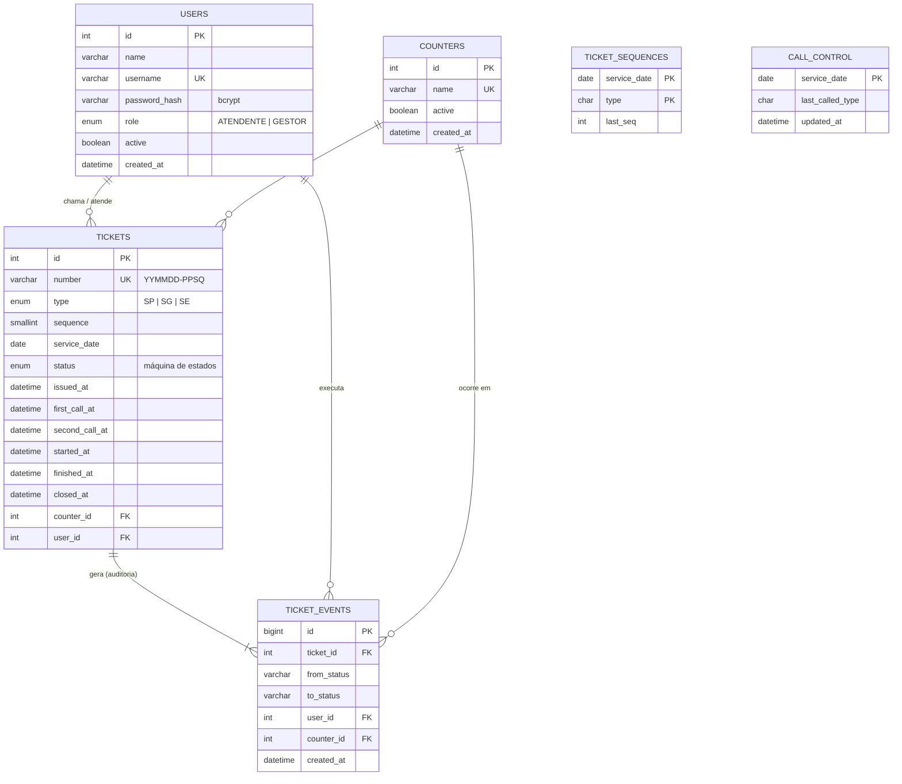

# Modelo Entidade-Relacionamento — nassauTickets

Banco de dados: **MySQL 8.0** (InnoDB, `utf8mb4`). O script físico está em [`backend/database/schema.sql`](../../backend/database/schema.sql).

## Diagrama

## Entidades

| Entidade | Descrição |
|----------|-----------|
| **USERS** | Agentes Atendentes (AA). O perfil `GESTOR` também atende e tem acesso a cadastros e relatórios. A senha é guardada apenas como hash bcrypt. |
| **COUNTERS** | Guichês de atendimento. Qualquer guichê atende qualquer tipo de senha. |
| **TICKETS** | Senhas emitidas no totem. Guardam o tipo, o número, o estado atual e todos os horários do ciclo de vida. O cliente é anônimo: nenhum dado pessoal é armazenado (LGPD). |
| **TICKET_EVENTS** | Trilha de auditoria: uma linha para cada transição de estado, com usuário, guichê e horário. |
| **TICKET_SEQUENCES** | Contador diário por tipo, usado para gerar o `SQ` do número (reinício diário). |
| **CALL_CONTROL** | Uma linha por dia. Serve de trava (*mutex*) para "chamar próxima" e guarda o último tipo chamado, que define a intercalação SP → SE\|SG. |

## Dicionário de dados — `tickets`

| Coluna | Tipo | Nulo | Descrição |
|--------|------|------|-----------|
| id | INT AUTO_INCREMENT | não | Chave primária. |
| number | VARCHAR(12) UNIQUE | não | Número no padrão `YYMMDD-PPSQ` (ex.: `260923-SP001`). |
| type | ENUM('SP','SG','SE') | não | Tipo da senha. |
| sequence | SMALLINT | não | Sequência diária do tipo (1 a 999). |
| service_date | DATE | não | Dia do expediente. |
| status | ENUM | não | EMITIDA, AGUARDANDO, CHAMADA, CHAMADA_NOVAMENTE, EM_ATENDIMENTO, ATENDIDA, NAO_COMPARECEU ou DESCARTADA. |
| issued_at | DATETIME(3) | não | Emissão no totem. |
| first_call_at | DATETIME(3) | sim | 1ª chamada. |
| second_call_at | DATETIME(3) | sim | 2ª chamada ("Última chamada"). |
| started_at | DATETIME(3) | sim | Início do atendimento. |
| finished_at | DATETIME(3) | sim | Fim do atendimento. |
| closed_at | DATETIME(3) | sim | Encerramento sem atendimento (não compareceu ou descartada). |
| counter_id | INT FK → counters | sim | Guichê que chamou a senha. |
| user_id | INT FK → users | sim | Atendente que chamou a senha. |

## Índices e decisões de projeto

| Índice | Motivo |
|--------|--------|
| `idx_tickets_queue (service_date, status, type, sequence)` | Busca rápida da próxima senha da fila (desempenho). |
| `idx_tickets_counter (counter_id, status)` | Encontrar a senha ativa de um guichê. |
| `idx_tickets_calls (service_date, first_call_at)` | Painel com as últimas chamadas. |
| `UNIQUE(number)` | Garantia extra de que nenhum número se repete. |

- **Concorrência:** "chamar próxima" abre uma transação `READ COMMITTED` e trava primeiro a linha do dia em `call_control` (`SELECT ... FOR UPDATE`). Duas requisições simultâneas são atendidas uma após a outra e nunca recebem a mesma senha.
- **Sequência diária:** `INSERT ... ON DUPLICATE KEY UPDATE last_seq = last_seq + 1` é atômico, então emissões simultâneas não repetem números.
- **Auditoria:** a aplicação só insere em `ticket_events` e nunca altera nem apaga esses registros.
