# Mockups e protótipos — nassauTickets

As telas abaixo foram capturadas do protótipo funcional (frontend React rodando com o backend e dados simulados).

| # | Tela | Agente | Arquivo |
|---|------|--------|---------|
| 1 | Página inicial | — | 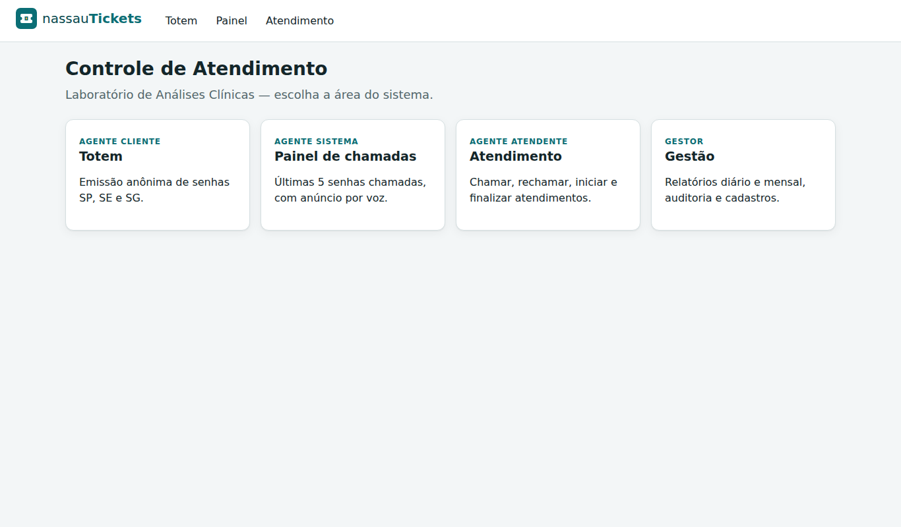 |
| 2 | Totem: escolha do tipo de senha | Cliente | 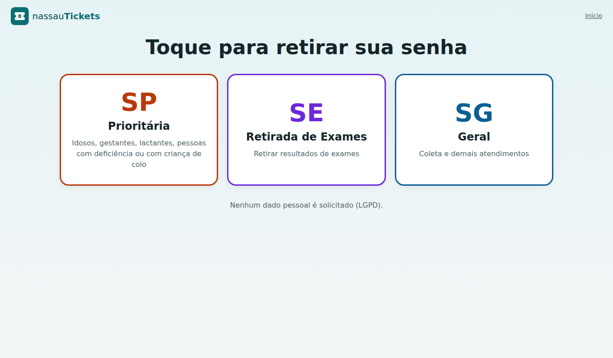 |
| 3 | Totem: senha emitida | Cliente | 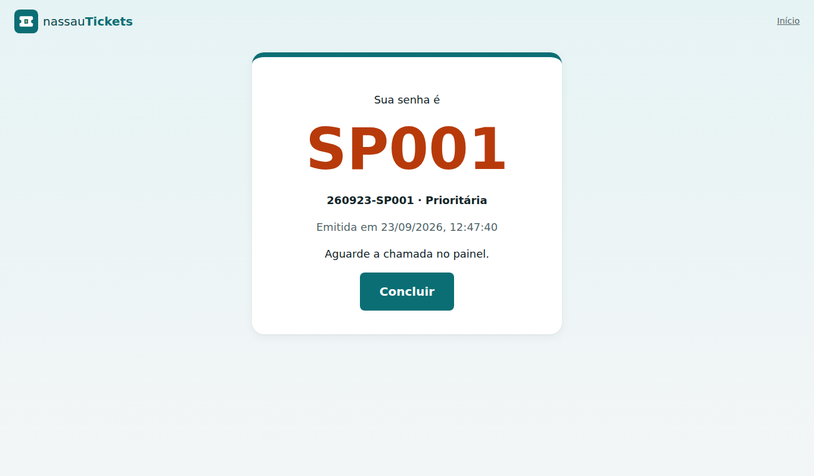 |
| 4 | Atendimento após o login | Atendente | 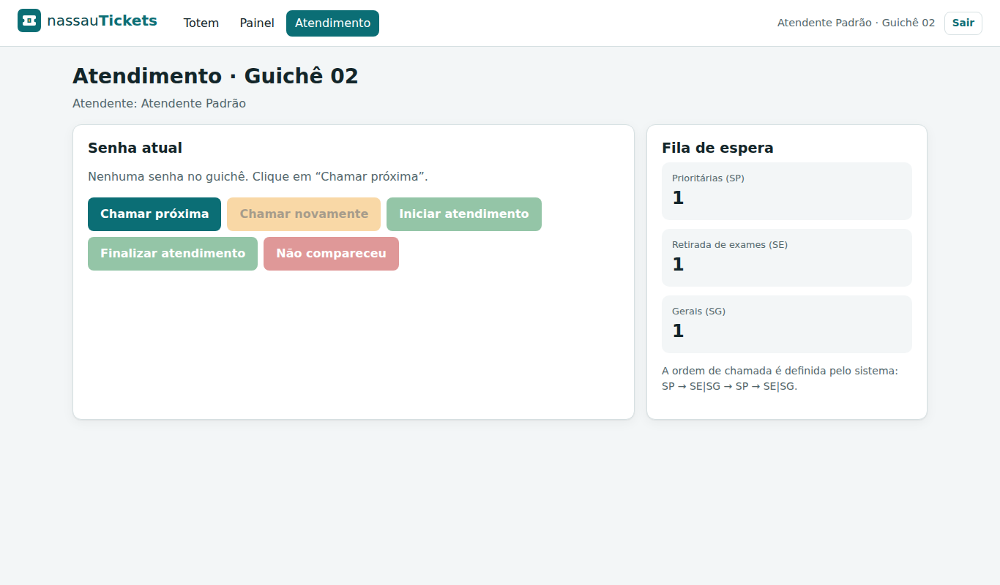 |
| 5 | Atendimento: senha chamada novamente | Atendente | 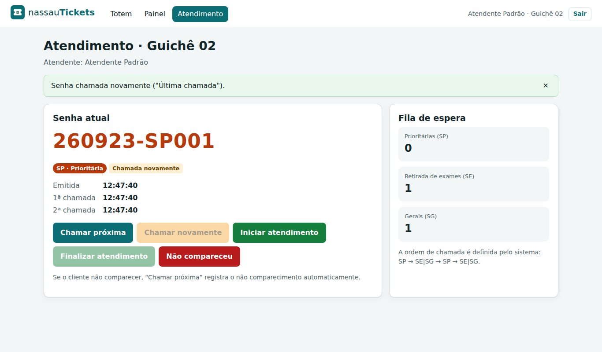 |
| 6 | Painel de chamadas (5 últimas) | Sistema |  |
| 7 | Relatório diário: resumo | Gestor | 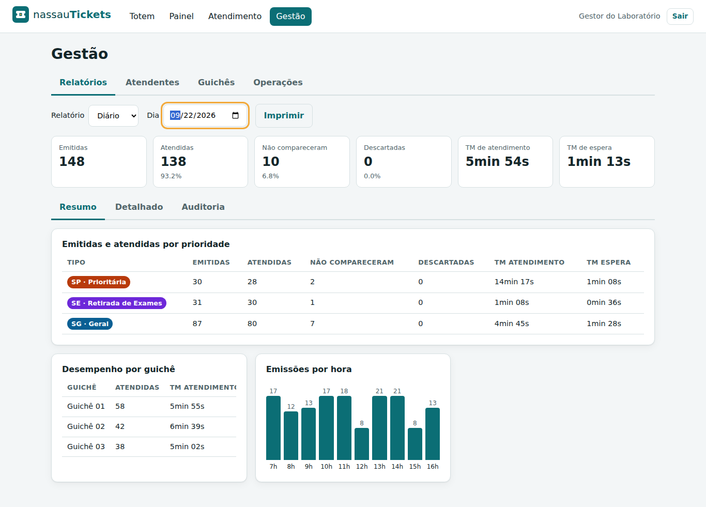 |
| 8 | Relatório de auditoria | Gestor | 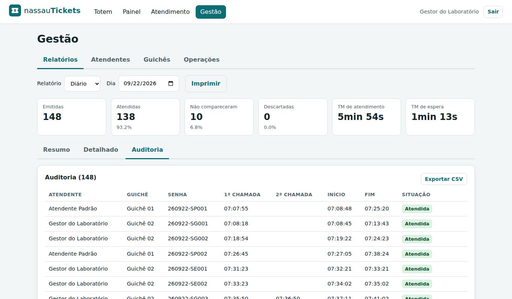 |
| 9 | Relatório mensal | Gestor | 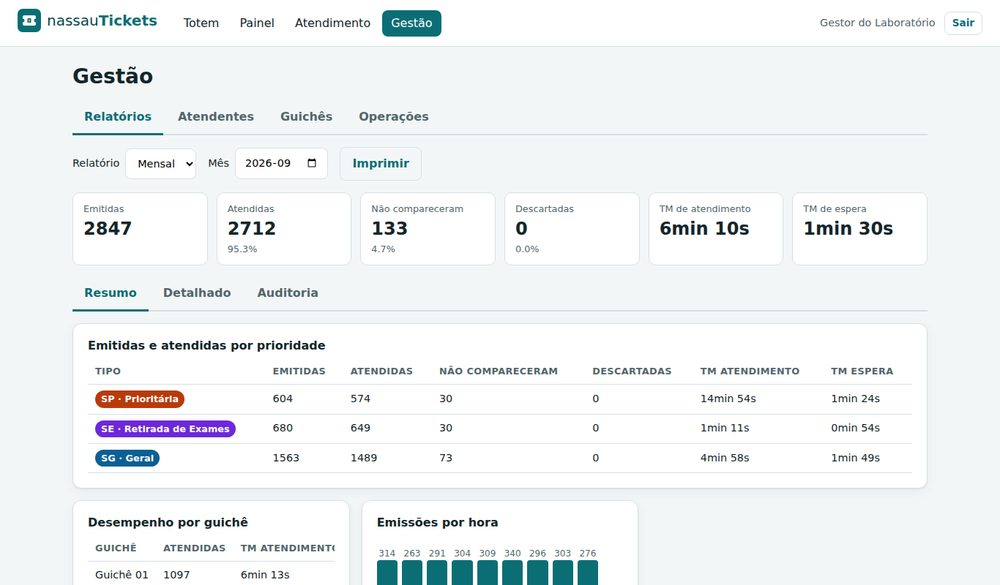 |
| 10 | Cadastro de atendentes | Gestor | 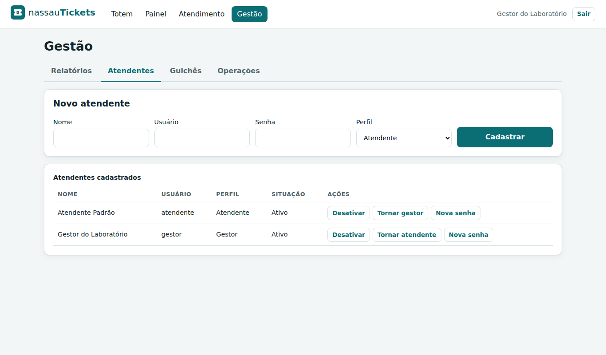 |
| 11 | Operações: simular dia e encerrar expediente | Gestor | 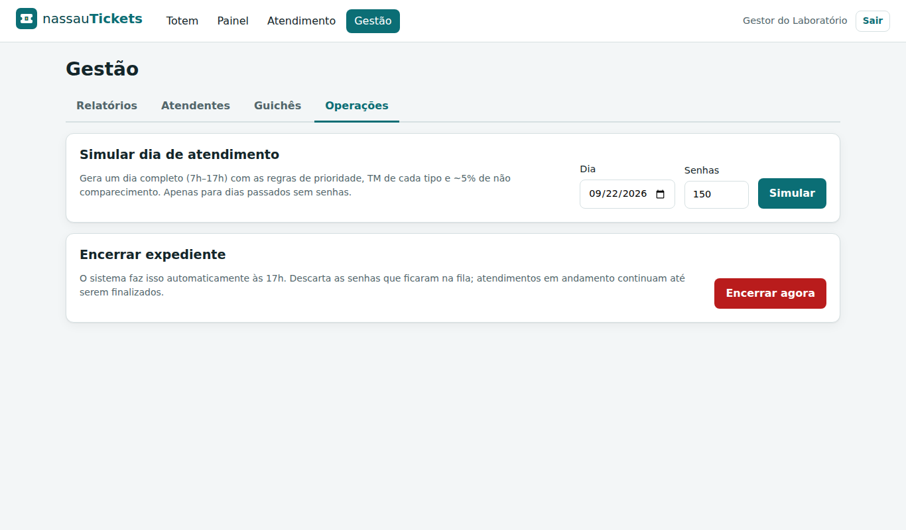 |
| 12 | Totem em tela de celular (responsivo) | Cliente | 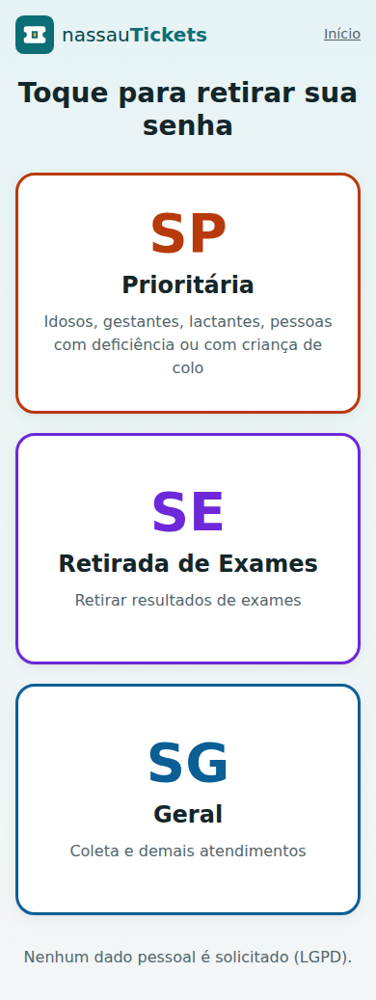 |
| 13 | Painel com o backend fora do ar | Sistema | 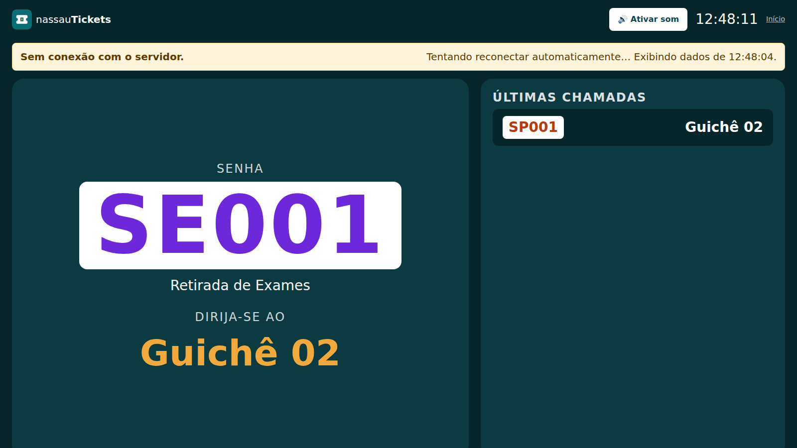 |
| 14 | Totem com o backend fora do ar | Cliente | 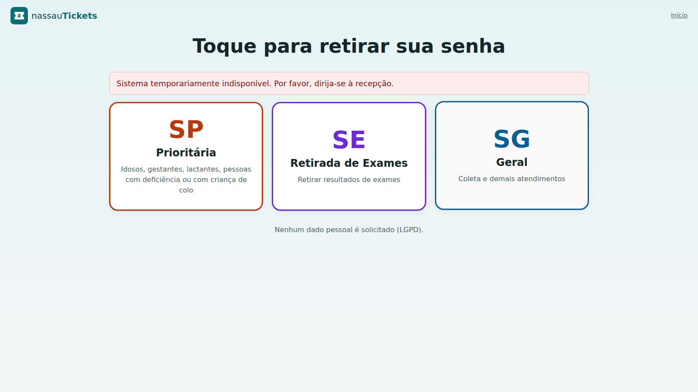 |

## Fluxo de navegação

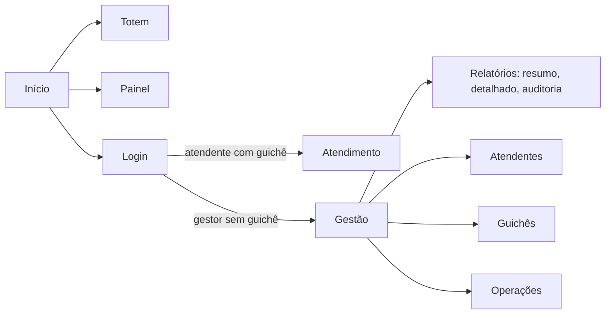
