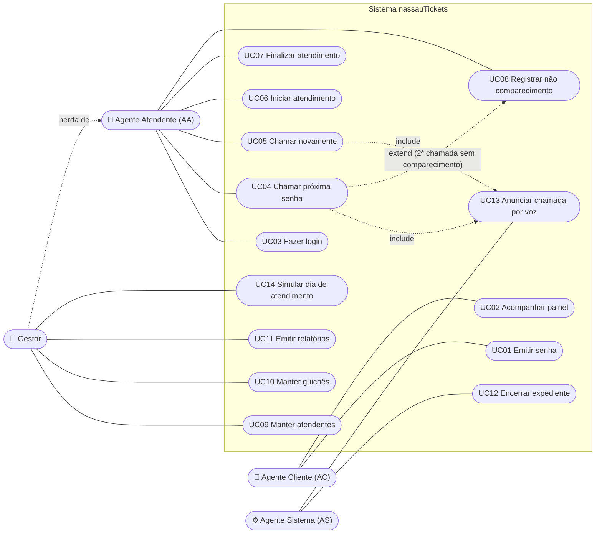

# Casos de Uso — nassauTickets

## Diagrama de casos de uso

## Especificação dos casos de uso

### UC01 — Emitir senha
- **Ator:** Agente Cliente (anônimo).
- **Pré-condição:** estar dentro do expediente (7h–17h).
- **Fluxo principal:**
  1. O cliente escolhe o tipo no totem: SP, SE ou SG.
  2. O sistema gera o número `YYMMDD-PPSQ`, grava a senha como EMITIDA e a coloca na fila (AGUARDANDO).
  3. O totem exibe o número, o tipo e a data/hora de emissão.
- **Fluxos alternativos:** fora do expediente, o totem informa que a emissão não está disponível. Se o servidor estiver fora do ar, o totem orienta o cliente a procurar a recepção.

### UC02 — Acompanhar painel
- **Ator:** Agente Cliente.
- **Fluxo:** o painel mostra em destaque a última senha chamada e as 4 anteriores, com o guichê. A próxima senha da fila **nunca** é exibida.

### UC03 — Fazer login
- **Ator:** Agente Atendente.
- **Fluxo:** o atendente informa usuário, senha e guichê. O sistema valida as credenciais (bcrypt) e devolve um token JWT. O gestor pode entrar sem guichê para usar apenas a gestão.

### UC04 — Chamar próxima senha
- **Ator:** Agente Atendente.
- **Pré-condição:** guichê sem atendimento em andamento.
- **Fluxo principal:**
  1. O atendente clica em "Chamar próxima".
  2. O sistema trava o controle de chamadas do dia (concorrência).
  3. O sistema escolhe a senha pela regra `[SP] → [SE|SG] → [SP] → [SE|SG]`, usando a próxima fila disponível quando uma estiver vazia.
  4. A senha passa para CHAMADA, e o painel exibe e anuncia a chamada (UC13).
- **Fluxos alternativos:** se a senha atual já foi chamada duas vezes, ela é registrada como NAO_COMPARECEU antes da nova chamada (UC08). Se a fila estiver vazia, o sistema informa "Não há senhas aguardando".

### UC05 — Chamar novamente
- **Pré-condição:** senha em CHAMADA.
- **Fluxo:** a senha passa para CHAMADA_NOVAMENTE e o painel repete o áudio precedido de "Última chamada". Só é permitido uma vez.

### UC06 — Iniciar atendimento
- **Pré-condição:** senha em CHAMADA ou CHAMADA_NOVAMENTE.
- **Fluxo:** o cliente comparece e o atendente inicia o atendimento (EM_ATENDIMENTO). O horário de início é registrado.

### UC07 — Finalizar atendimento
- **Pré-condição:** senha EM_ATENDIMENTO.
- **Fluxo:** o atendente finaliza (ATENDIDA). É permitido mesmo depois das 17h.

### UC08 — Registrar não comparecimento
- **Pré-condição:** senha em CHAMADA_NOVAMENTE (já chamada duas vezes).
- **Fluxo:** a senha passa para NAO_COMPARECEU (abandonada).

### UC09 / UC10 — Manter atendentes e guichês
- **Ator:** Gestor.
- **Fluxo:** cadastrar, renomear, ativar/desativar, alterar perfil e redefinir senha. O gestor não pode desativar o próprio usuário.

### UC11 — Emitir relatórios
- **Ator:** Gestor.
- **Fluxo:** escolher relatório diário (dia) ou mensal (mês). O sistema exibe totais de emitidas e atendidas (geral e por prioridade), TM de atendimento e de espera, desempenho por guichê, emissões por hora, relatório detalhado e auditoria, com exportação para CSV e impressão.

### UC12 — Encerrar expediente
- **Ator:** Agente Sistema (automático, a cada minuto) ou Gestor (manual).
- **Fluxo:** depois das 17h, as senhas ainda na fila passam para DESCARTADA. Chamadas de dias anteriores nunca iniciadas passam para NAO_COMPARECEU. Atendimentos em andamento não são alterados.

### UC13 — Anunciar chamada por voz
- **Ator:** Agente Sistema (painel).
- **Fluxo:** a cada nova chamada, o painel fala "Senha prioritária, S P 0 0 1. Dirija-se ao Guichê 01". Na rechamada, a frase começa com "Última chamada".

### UC14 — Simular dia de atendimento
- **Ator:** Gestor.
- **Fluxo:** gera um dia passado completo, com chegadas aleatórias, TM de cada tipo e cerca de 5% de não comparecimento, para alimentar os relatórios.
