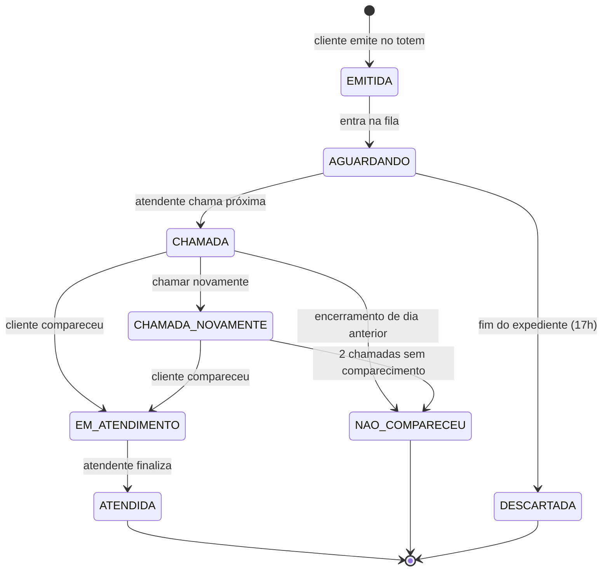
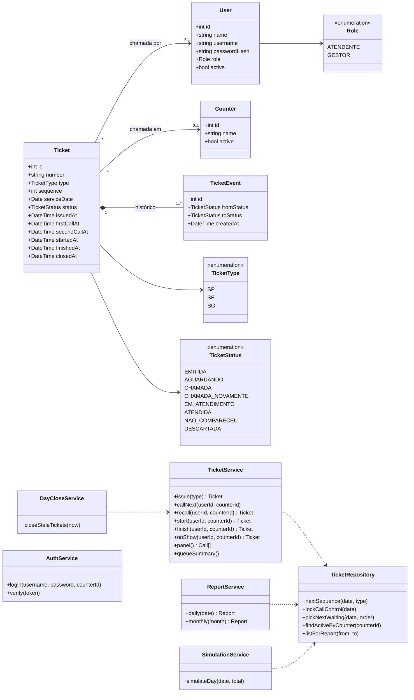
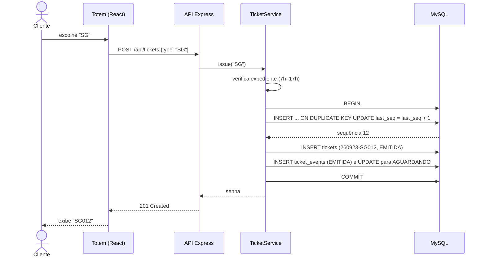
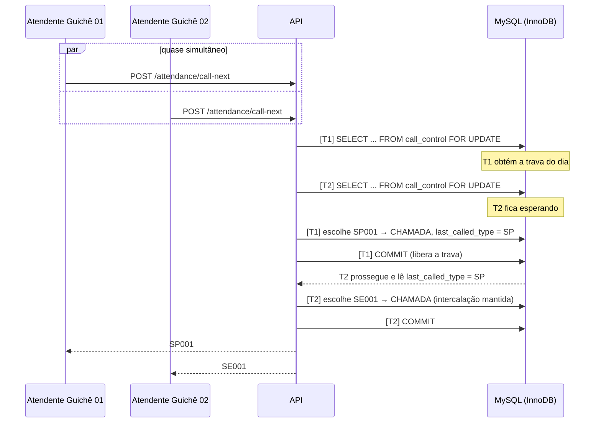
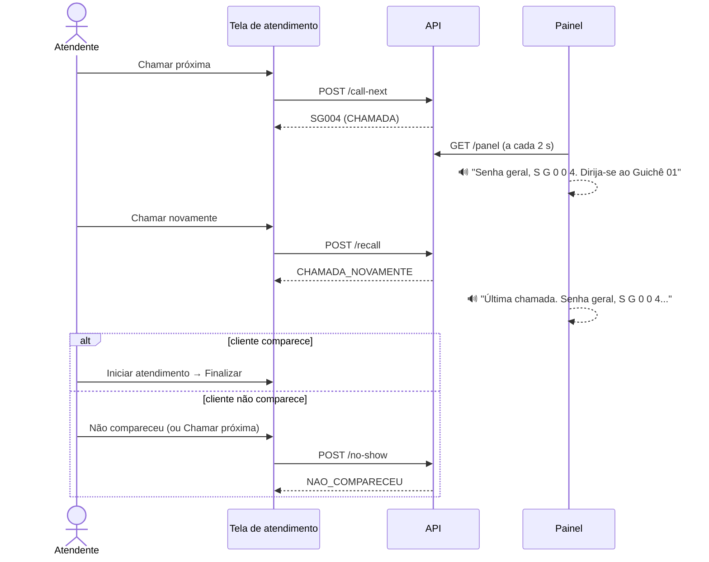
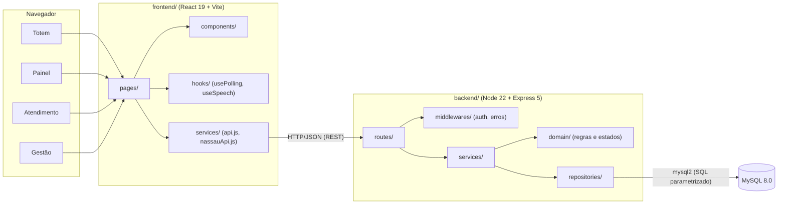

# Diagramas UML — nassauTickets

## 1. Diagrama de estados da senha

As transições permitidas ficam centralizadas em `backend/src/domain/ticketStateMachine.js`. Qualquer outra transição é recusada com HTTP 409.

## 2. Diagrama de classes (domínio e serviços)

## 3. Sequência — emitir senha (UC01)

## 4. Sequência — dois atendentes chamam ao mesmo tempo (concorrência)

A trava do dia é sempre a **primeira** a ser obtida. Essa ordem única de travas, junto com o isolamento `READ COMMITTED`, evita deadlocks. Se o MySQL ainda assim acusar um deadlock, a transação é repetida automaticamente (até 3 tentativas).

## 5. Sequência — chamar novamente e não comparecimento

## 6. Diagrama de componentes (arquitetura)

